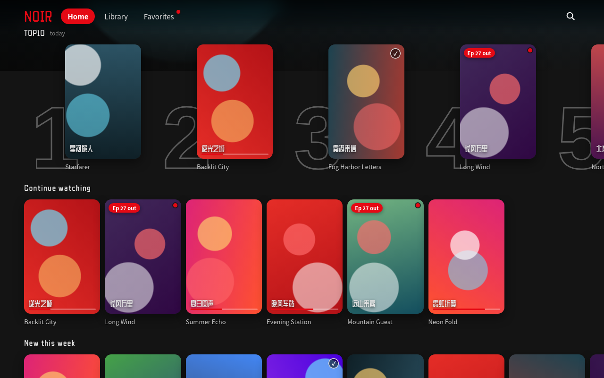

<p align="center">
  
</p>

<h1 align="center">NOIR TV UI</h1>

<p align="center">
  A dark, poster-first media UI kit for <b>phones, desktops and Android TV boxes</b>.<br>
  Plain HTML · CSS custom properties · vanilla JS. No framework, no build step.
</p>

<p align="center">
  <a href="https://zhengge6.github.io/noir-tv-ui/demo/"><b>Live demo</b></a> ·
  <a href="#usage">Usage</a> ·
  <a href="#design-tokens">Tokens</a> ·
  <a href="#tv-remote--d-pad-focus">TV focus</a> ·
  <a href="#android-webview-back-handling">WebView back</a>
</p>

> **中文简介**：NOIR 是一套深色、以海报为中心的影视类界面组件。它同时适配手机、桌面浏览器和安卓电视盒子（遥控器方向键）。
> 只用原生 HTML/CSS/JS，没有框架，也不需要构建步骤。内容包括设计令牌、巨幅海报、带 TOP10 描边数字的海报行、观看状态角标、
> 胶囊按钮与标签、底部弹出详情、网格页、管理模式（多选删除），以及能配合安卓系统返回键/手势的返回栈。

---

## What's inside

| File | What it is |
|---|---|
| [`tokens.css`](tokens.css) | Design tokens as CSS custom properties: color, type, radii, elevation, focus, gradient-blur nav, motion |
| [`noir.css`](noir.css) | Components: top nav, hero billboard, poster rows, TOP10 numerals, poster card and watch-state badges, pill buttons and chips, detail sheet, grid page, management mode, confirm dialog, toast |
| [`noir.js`](noir.js) | Behaviour: input modes, **back stack**, D-pad focus, long-press, management mode, sheet, confirm, toast (about 280 lines, no dependencies) |
| [`demo/index.html`](demo/index.html) | Self-contained demo with abstract gradient posters and invented titles. Open the file directly or use GitHub Pages |
| [`fonts/README.md`](fonts/README.md) | Display font notes (ZCOOL QingKe HuangYou, SIL OFL 1.1) and a self-hosting recipe |

<p align="center">
  
  &nbsp;
  
  &nbsp;
  
</p>

## Components

- **Top nav.** A gradient scrim plus a masked, progressive `backdrop-filter` blur. The active item is a red pill. With a remote, the focused active pill glows brighter instead of getting a white ring.
- **Hero billboard.** Full-bleed art with a vignette, a display-font title, score, an episode pill, and Play / Details pill buttons.
- **Poster rows.** Horizontally scrolling rows with hidden scrollbars. Focus scrolls the row so the focused card stays in view.
- **TOP10 row.** Outlined numerals (`-webkit-text-stroke`) tucked behind each poster. The tenth item gets a wider slot.
- **Poster card.** Rounded corners and a soft shadow. Watch-state badges:
  - `noir-badge-bar` for in progress (thin rounded bar)
  - `noir-badge-check` for finished (small round ✓)
  - `noir-badge-update` + `noir-badge-dot` for finished but with new episodes
- **Pill buttons and chips.** `play`, `ghost`, `glass` (toggle with `.on`), and `danger`. Chips work as sort tabs or toolbar actions.
- **Detail sheet.** A centred panel on desktop and a bottom sheet on phones. On close it slides down while the scrim fades. The layout keeps `display:flex` in both states, so nothing jumps.
- **Grid page.** A responsive `auto-fill` grid, three columns on phones.
- **Management mode.** Enter it with a Manage chip, a touch long-press, or by holding OK on a remote. It offers × per card, multi-select, select all, and delete-selected with a focusable confirm dialog. One controller can serve any number of lists.

<p align="center"></p>

## Usage

```html
<link rel="stylesheet" href="https://fonts.googleapis.com/css2?family=ZCOOL+QingKe+HuangYou&display=swap">
<link rel="stylesheet" href="tokens.css">
<link rel="stylesheet" href="noir.css">
<script src="noir.js"></script>

<section class="noir-row">
  <div class="noir-row-title">Continue watching</div>
  <div class="noir-row-scroll">
    <button class="noir-card" data-id="42">
      <span class="noir-poster">
        
        <span class="noir-badge-bar"><i style="width:40%"></i></span>
      </span>
      <span class="noir-card-name">Title</span>
    </button>
  </div>
</section>
```

```js
NOIR.input.init({ tv: isTvBox });          // adds html.kbd / html.tv for focus styles
NOIR.focus.init();                         // arrow keys move focus geometrically

const nav = NOIR.backStack(tag => {        // popstate: `tag` is the level now on top ("" = home)
  if (tag !== "detail") sheet.close(true);
  showPage(tag);                           // close everything above `tag`
});
const sheet = NOIR.sheet(document.querySelector(".noir-modal"), nav);
const confirmBox = NOIR.confirm(document.querySelector(".noir-confirm"), nav);

function openPage(name) {                  // sub-levels push, sibling tabs replace
  if (!currentPage) nav.push(name); else nav.replace(name);
}
```

The theme is customised by overriding tokens:

```css
:root { --noir-brand: #7c5cff; --noir-radius-poster: 10px; }
```

## Design tokens

<p align="center"></p>

| Token | Value | Use |
|---|---|---|
| `--noir-canvas` | `#141414` | Page background |
| `--noir-surface` | `#181818` | Sheets and panels |
| `--noir-brand` | `#E50914` | Active nav pill, progress, badges, destructive actions |
| `--noir-score` | `#46d369` | Rating |
| `--noir-text` / `--noir-muted` | `#e5e5e5` / `#808080` | Body and secondary text |
| `--noir-update` | `#ff5a63` | "New episode" accents |
| `--noir-font-display` | ZCOOL QingKe HuangYou → system CJK | Hero title, row titles, wordmark |
| `--noir-font-body` | -apple-system / PingFang SC / Noto Sans SC | Everything else |
| `--noir-radius-poster` | `14px` (`12px` on phones) | Posters and cards |
| `--noir-radius-panel` | `22px` | Sheets and dialogs |
| `--noir-radius-pill` | `999px` | Buttons, chips, nav items |
| `--noir-shadow-poster` | `0 8px 22px rgba(0,0,0,.45)` | Poster elevation |
| `--noir-focus-ring` | `0 0 0 3px #141414, 0 0 0 6px #fff` | Keyboard and remote focus (double ring) |
| `--noir-focus-scale` | `1.08` | Focused card and nav item scale |
| `--noir-nav-gradient` / `--noir-nav-blur` / `--noir-nav-mask` | see file | Gradient-blur top nav |
| `--noir-ease-out` / `--noir-ease-in` | cubic-bezier | Open and close motion |

## TV remote / D-pad focus

- `html.tv` (forced) or `html.kbd` (set on the first arrow key, cleared on touch or mouse) switches on focus visuals: white double rings on buttons and chips, a 1.08 scale on posters, and a glow on the active nav pill. Touch users never see focus rings.
- `NOIR.focus.move(dir)` picks the nearest focusable element in the arrow's direction. Left and right strongly prefer the same row, while up and down tolerate horizontal offset, which suits rows of posters.
- Focus is scoped to the top layer: an open confirm dialog first, then an open sheet, then the page. Rows scroll horizontally to keep the focused card in view.
- `NOIR.longPress` treats holding OK for ≥ 600 ms as a long-press. A short OK still clicks, on key-up. MENU / ContextMenu is a good second entry point to management mode.
- Use real `<button>`s. They are focusable, announce correctly, and fire `click` on OK/Enter.

## Android WebView back handling

Many Android hosts implement the system back gesture or key for an embedded page roughly like this:

```java
if (webView.canGoBack() && !samePage(currentUrl, homeUrl)) webView.goBack(); else super.onBackPressed();
```

`samePage` usually compares the URL **including the `#fragment`**. A single-page app that calls
`history.pushState(state, "")` without changing the URL looks like it is still on the home URL, so back
leaves the page instead of closing a sheet. `NOIR.backStack` avoids this:

1. Every secondary level pushes its own hash: `#detail`, `#lib`, `#manage`, `#confirm`, and so on, with `history.state = {noir: tag, d: depth}`.
2. `popstate` is **state-driven**. Your callback receives the level now on top and closes everything above it, so system back, browser back, Esc and in-app close buttons all agree.
3. Sibling tabs use `replace()`, so back from any tab returns home in one step. Going home from deep inside uses `history.go(-depth)`.
4. In-app close buttons call `nav.back(tag)`, which pops only if that level is on top. This prevents double pops.
5. On a cold start with a leftover hash, the URL is reset, so the first back exits as the user expects.

The soft keyboard needs no extra code: Android's first back hides it, and the next back pops the search level.

## Demo

Open `demo/index.html` directly from disk, or visit the [GitHub Pages demo](https://zhengge6.github.io/noir-tv-ui/demo/).
Add `?tv=1` to force TV focus visuals. All art is generated CSS gradients, and all titles are invented.

## License

[MIT](LICENSE) for code and docs. The display font **ZCOOL QingKe HuangYou** is © its authors, licensed under the
[SIL Open Font License 1.1](https://openfontlicense.org) and loaded from Google Fonts in the demo. This repository does not
redistribute it.
