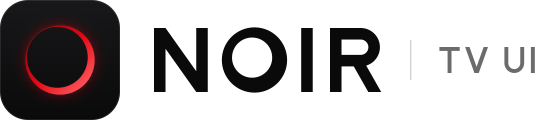
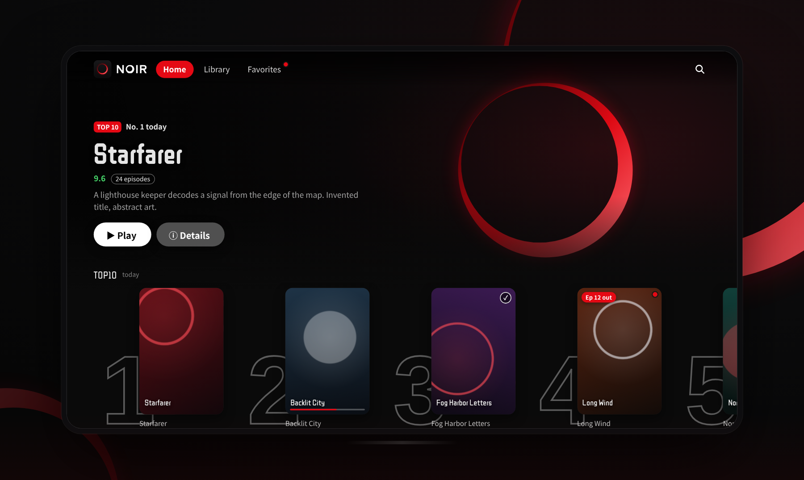
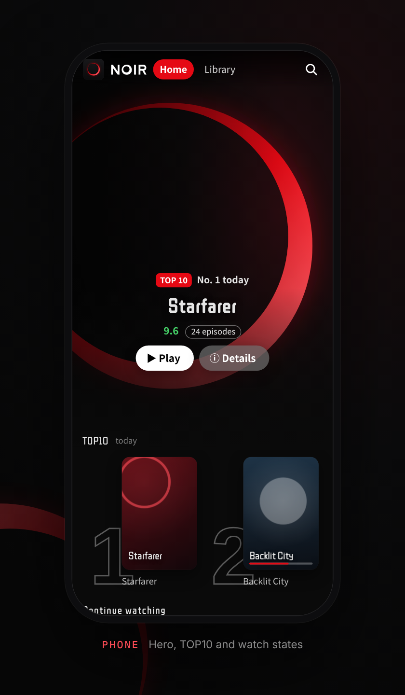
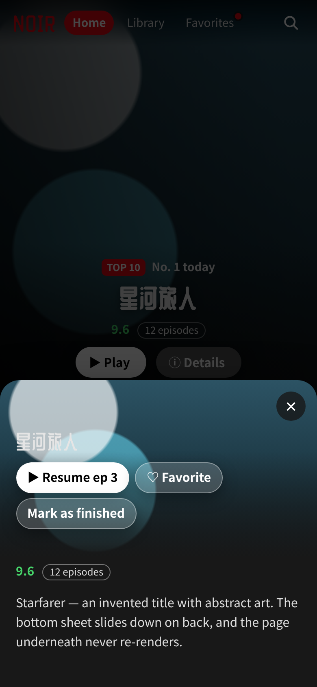
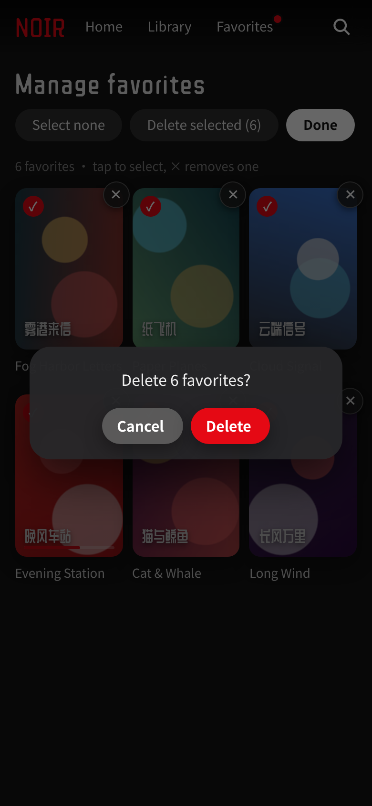
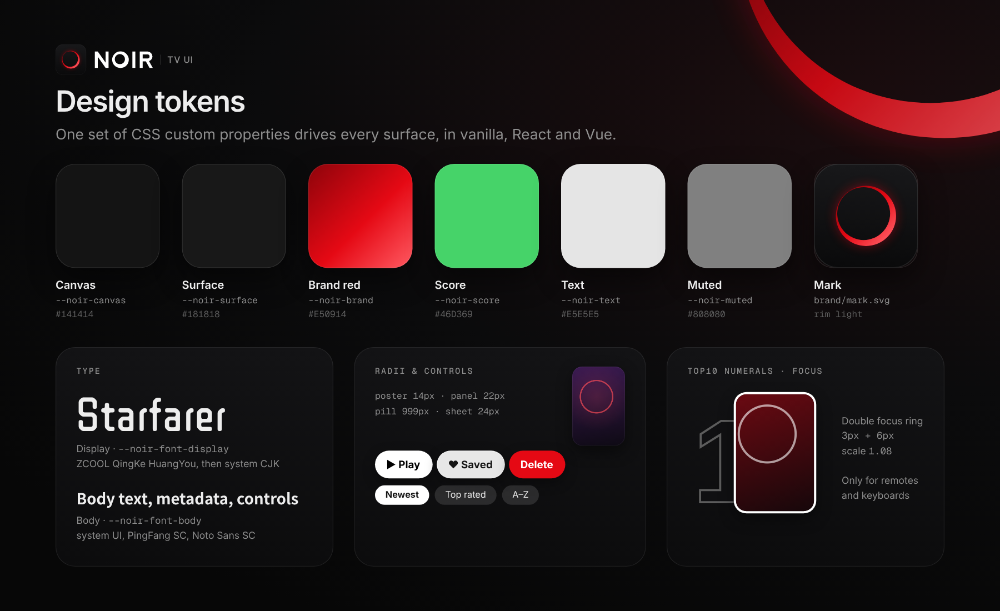

<p align="center">
  <a href="https://zhengge6.github.io/noir-tv-ui/demo/">
    <picture>
      <source media="(prefers-color-scheme: dark)" srcset="brand/logo-dark.svg">
      <source media="(prefers-color-scheme: light)" srcset="brand/logo-light.svg">
      
    </picture>
  </a>
</p>

<p align="center">
  <b>Cinematic UI for the big screen.</b><br>
  A dark, poster-first UI kit for TV boxes, phones and Android WebView streaming homepages.<br>
  Framework-free core, first-class React and Vue bindings, and zero runtime dependencies.
</p>

<p align="center">
  <a href="LICENSE"></a>
  <a href="CHANGELOG.md"></a>
  <a href="#react"></a>
  <a href="#vue"></a>
  
  
</p>

<p align="center">
  <a href="https://zhengge6.github.io/noir-tv-ui/demo/"><b>Live demo</b></a> ·
  <a href="https://zhengge6.github.io/noir-tv-ui/demo/react/">React demo</a> ·
  <a href="https://zhengge6.github.io/noir-tv-ui/demo/vue/">Vue demo</a> ·
  <a href="docs/README.md">Docs</a> ·
  <a href="CHANGELOG.md">Changelog</a> ·
  <a href="#中文简介">中文</a>
</p>

<p align="center">
  
</p>

---

## Why NOIR

Most UI kits are built for a mouse and a scrollbar. Streaming homepages on a TV box or inside an Android
WebView need different things: focus you can see from three metres away, arrow-key navigation that feels
natural across rows of posters, and a back button that closes a sheet instead of quitting the app.
NOIR packages those patterns as a small set of design tokens, CSS components and helpers.

## Features

<table>
  <tr>
    <td width="33%" valign="top"><b>🎬 Poster-first components</b><br>Hero billboard, scrolling poster rows, TOP10 outlined numerals, grid pages, a detail sheet, toasts and a confirm dialog.</td>
    <td width="33%" valign="top"><b>🕹️ D-pad focus</b><br>Geometric arrow-key focus tuned for poster rows, focus scoped to the top layer, and long-press OK. Focus rings appear only for keyboards and remotes.</td>
    <td width="33%" valign="top"><b>↩️ WebView-safe back stack</b><br>One <code>#hash</code> history entry per level, so Android system back closes the sheet or page on top instead of leaving.</td>
  </tr>
  <tr>
    <td valign="top"><b>🎨 Design tokens</b><br>Color, type, radii, elevation, focus and motion as CSS custom properties. Re-theme the kit with a handful of overrides.</td>
    <td valign="top"><b>⚛️ React and Vue</b><br>Typed components plus <code>useBackStack</code> and <code>useDpadFocus</code> for both frameworks, wrapping the same CSS classes.</td>
    <td valign="top"><b>🪶 Zero dependencies</b><br>About 9 kB gzip for the core CSS and JS. The vanilla build needs no build step: link two stylesheets and one script.</td>
  </tr>
  <tr>
    <td valign="top"><b>📺 Watch-state badges</b><br>An in-progress bar, a finished check, and a "new episodes" tag with a dot, all driven by one prop.</td>
    <td valign="top"><b>📱 Responsive by default</b><br>A centred panel on desktop becomes a bottom sheet on phones. Safe-area insets are respected in WebViews.</td>
    <td valign="top"><b>🧹 Management mode</b><br>Multi-select, select all and delete with a focusable confirm dialog. It works with touch long-press or a held OK on a remote.</td>
  </tr>
</table>

## Quick start

The repository is a small npm-workspaces monorepo:

| Package | Path | What it is |
|---|---|---|
| `@noir-tv-ui/core` | [`packages/core`](packages/core) | `tokens.css`, `noir.css`, `noir.js` (vanilla, no build step) and an ES module entry |
| `@noir-tv-ui/react` | [`packages/react`](packages/react) | Typed React components and hooks |
| `@noir-tv-ui/vue` | [`packages/vue`](packages/vue) | Vue 3 components (`defineComponent`) and composables |

> **npm publish pending.** The packages are not on the npm registry yet. Use the CDN links for vanilla, or
> build the packages from this repository as shown below.

### Vanilla (CDN, no build step)

```html
<link rel="stylesheet" href="https://cdn.jsdelivr.net/gh/zhengge6/noir-tv-ui@main/packages/core/tokens.css">
<link rel="stylesheet" href="https://cdn.jsdelivr.net/gh/zhengge6/noir-tv-ui@main/packages/core/noir.css">
<script src="https://cdn.jsdelivr.net/gh/zhengge6/noir-tv-ui@main/packages/core/noir.js"></script>

<section class="noir-row">
  <div class="noir-row-title">Continue watching</div>
  <div class="noir-row-scroll">
    <button class="noir-card">
      <span class="noir-poster">
        <span class="art" style="background:linear-gradient(135deg,#41295a,#2f0743)"></span>
        <span class="noir-badge-bar"><i style="width:40%"></i></span>
      </span>
      <span class="noir-card-name">Paper Planes</span>
    </button>
  </div>
</section>

<script>
  NOIR.input.init({ tv: /[?&]tv=1/.test(location.search) }); // focus visuals for keyboards and remotes
  NOIR.focus.init();                                           // arrow keys move focus geometrically
</script>
```

For production, pin `@main` to a commit hash. You can also copy `packages/core` into your project.

### npm (from this repository)

```bash
git clone https://github.com/zhengge6/noir-tv-ui.git && cd noir-tv-ui
npm install
npm run build                # builds @noir-tv-ui/react, @noir-tv-ui/vue and both examples
npm pack -w @noir-tv-ui/core -w @noir-tv-ui/react -w @noir-tv-ui/vue
# then in your app:
npm install /path/to/noir-tv-ui-core-0.2.0.tgz /path/to/noir-tv-ui-react-0.2.0.tgz
```

Once published, this becomes `npm install @noir-tv-ui/react` (or `@noir-tv-ui/vue`).

### React

```tsx
import "@noir-tv-ui/core/tokens.css";
import "@noir-tv-ui/core/noir.css";
import { BottomSheet, Hero, Pill, PosterCard, PosterRow, useBackStack, useDpadFocus } from "@noir-tv-ui/react";

export function Home() {
  useDpadFocus();
  const nav = useBackStack();                     // system back pops "detail" first
  return (
    <>
      <Hero title="Starfarer" art="linear-gradient(135deg,#0f2027,#2c5364)" score="9.6" pill="12 episodes"
        actions={<Pill variant="play">▶ Play</Pill>} />
      <PosterRow title="Continue watching">
        <PosterCard title="Backlit City" art="linear-gradient(135deg,#e52d27,#b31217)"
          watch="progress" progress={40} onClick={() => nav.push("detail")} />
        <PosterCard title="Fog Harbor Letters" watch="updated" updateLabel="Ep 12 out" />
      </PosterRow>
      <BottomSheet open={nav.level === "detail"} onClose={() => nav.back("detail")} title="Backlit City"
        actions={<Pill variant="play" autoFocusOnOpen>▶ Resume</Pill>}>
        An invented title with abstract art.
      </BottomSheet>
    </>
  );
}
```

A complete app lives in [`examples/react-vite`](examples/react-vite) (`npm run dev -w example-react-vite`).

### Vue

```vue
<script setup lang="ts">
import "@noir-tv-ui/core/tokens.css";
import "@noir-tv-ui/core/noir.css";
import { BottomSheet, Pill, PosterCard, PosterRow, useBackStack, useDpadFocus } from "@noir-tv-ui/vue";

useDpadFocus();
const nav = useBackStack();
const level = nav.level;
</script>

<template>
  <PosterRow title="Continue watching">
    <PosterCard title="Backlit City" art="linear-gradient(135deg,#e52d27,#b31217)"
      watch="progress" :progress="40" @select="nav.push('detail')" />
  </PosterRow>
  <BottomSheet :open="level === 'detail'" title="Backlit City" @close="nav.back('detail')">
    <template #actions><Pill variant="play" autofocus-on-open>▶ Resume</Pill></template>
    An invented title with abstract art.
  </BottomSheet>
</template>
```

A complete app lives in [`examples/vue-vite`](examples/vue-vite) (`npm run dev -w example-vue-vite`). The optional
`NoirPlugin` registers every component globally as `<NoirPosterCard>` and so on.

## Components

| Component | CSS class | Vanilla | React | Vue |
|---|---|:---:|:---:|:---:|
| Top nav with gradient blur and red active pill | `.noir-topbar` `.noir-nav` | ✅ | `NavBar` | `NavBar` |
| Hero billboard | `.noir-hero` | ✅ | `Hero` | `Hero` |
| Poster row (hidden scrollbar, focus-follow) | `.noir-row` | ✅ | `PosterRow` | `PosterRow` |
| Poster card with watch-state badges | `.noir-card` `.noir-badge-*` | ✅ | `PosterCard` | `PosterCard` |
| TOP10 outlined numerals | `.noir-card-top` | ✅ | `PosterCard rank` | `PosterCard rank` |
| Pill buttons: play, ghost, glass, danger | `.noir-btn` | ✅ | `Pill` | `Pill` |
| Chips (sort tabs, toolbars) | `.noir-chip` | ✅ | `Chip` | `Chip` |
| Grid page | `.noir-grid` | ✅ | `PosterGrid` | `PosterGrid` |
| Detail sheet (panel on desktop, bottom sheet on phones) | `.noir-modal` `.noir-sheet` | `NOIR.sheet` | `BottomSheet` | `BottomSheet` |
| Back stack | — | `NOIR.backStack` | `useBackStack` | `useBackStack` |
| D-pad focus | `html.kbd` / `html.tv` | `NOIR.focus` | `useDpadFocus` | `useDpadFocus` |
| Management mode, confirm dialog, toast | `.noir-mitem` `.noir-confirm` `.noir-toast` | `NOIR.manager` `NOIR.confirm` `NOIR.toast` | `toast` | `toast` |

Props and helper signatures are listed in the [docs](docs/README.md).

<p align="center">
  
  &nbsp;
  
  &nbsp;
  
</p>

## Design tokens

Every visual decision is a CSS custom property in [`tokens.css`](packages/core/tokens.css). Override them to re-theme:

```css
:root { --noir-brand: #7c5cff; --noir-radius-poster: 10px; }
```

| Token | Default | Use |
|---|---|---|
| `--noir-canvas` | `#141414` | Page background |
| `--noir-surface` | `#181818` | Sheets and panels |
| `--noir-brand` | `#E50914` | Active nav pill, progress, badges, destructive actions |
| `--noir-score` | `#46d369` | Rating |
| `--noir-text` / `--noir-muted` | `#e5e5e5` / `#808080` | Body and secondary text |
| `--noir-update` | `#ff5a63` | "New episodes" accents |
| `--noir-font-display` | ZCOOL QingKe HuangYou → system CJK | Hero title, row titles, wordmark |
| `--noir-font-body` | -apple-system / PingFang SC / Noto Sans SC | Everything else |
| `--noir-radius-poster` | `14px` (`12px` on phones) | Posters and cards |
| `--noir-radius-panel` | `22px` | Sheets and dialogs |
| `--noir-radius-pill` | `999px` | Buttons, chips, nav items |
| `--noir-shadow-poster` | `0 8px 22px rgba(0,0,0,.45)` | Poster elevation |
| `--noir-focus-ring` | `0 0 0 3px #141414, 0 0 0 6px #fff` | Keyboard and remote focus (double ring) |
| `--noir-focus-scale` | `1.08` | Focused card and nav item scale |
| `--noir-nav-gradient` / `--noir-nav-blur` / `--noir-nav-mask` | see file | Gradient-blur top nav |
| `--noir-ease-out` / `--noir-ease-in` | cubic-bezier | Open and close motion |

<p align="center"></p>

## TV remote and D-pad focus

- `html.tv` (forced) or `html.kbd` (set on the first arrow key, cleared on touch or mouse) turns on focus visuals:
  white double rings on buttons and chips, a 1.08 scale on posters, and a glow on the active nav pill. Touch users never see focus rings.
- `NOIR.focus.move(dir)` picks the nearest focusable element in the arrow's direction. Left and right strongly prefer
  the same row, while up and down tolerate horizontal offset, which suits rows of posters.
- Focus is scoped to the top layer: an open confirm dialog first, then an open sheet, then the page. Rows scroll
  horizontally to keep the focused card in view.
- `NOIR.longPress` treats holding OK for 600 ms or more as a long-press. A short OK still clicks, on key-up.
- Use real `<button>` elements. They are focusable, announce correctly, and fire `click` on OK/Enter. All React and Vue components render buttons.
- In React and Vue, `useDpadFocus({ tv })` installs the same behaviour once per page. Add `?tv=1` to any demo URL to force TV visuals.

## Android WebView back handling

Many Android hosts implement the system back gesture for an embedded page roughly like this:

```java
if (webView.canGoBack() && !samePage(currentUrl, homeUrl)) webView.goBack(); else super.onBackPressed();
```

`samePage` usually compares the URL **including the `#fragment`**. A single-page app that calls
`history.pushState(state, "")` without changing the URL looks like it is still on the home URL, so back
leaves the page instead of closing a sheet. The back stack avoids this:

1. Every secondary level pushes its own hash (`#detail`, `#lib`, `#confirm`, and so on) with `history.state = { noir: tag, d: depth }`.
2. `popstate` is **state-driven**. Your callback receives the level now on top and closes everything above it, so system back, browser back, Esc and in-app close buttons all agree.
3. Sibling tabs use `replace()`, so back from any tab returns home in one step. `home()` uses `history.go(-depth)`.
4. In-app close buttons call `back(tag)`, which pops only if that level is on top. This prevents double pops.
5. On a cold start with a leftover hash, the URL is reset, so the first back exits as the user expects.

`useBackStack()` exposes the same API in React and Vue, plus a reactive `level` you can bind a sheet's `open` prop to.

## Browser and WebView support

| Target | Status |
|---|---|
| Android System WebView / Chrome 84+ | ✅ Primary target (TV boxes, phones) |
| Chrome, Edge, Firefox (current) | ✅ |
| Safari 15.4+ / iOS WKWebView | ✅ |
| Older Android WebViews (Chromium < 84) | ⚠️ Usable; flex `gap` spacing and the progressive blur degrade |

`noir.js` is written in ES5 and runs on old WebViews. Vite's default build targets modern browsers, so for
older TV boxes set `build.target` (for example `chrome69`) or add `@vitejs/plugin-legacy` in your app.

## How it compares

NOIR is not a general-purpose component library such as MUI or Vuetify, and it is not a canvas or WebGL TV framework
such as Lightning. It is a thin layer of CSS and helpers for HTML streaming homepages, the kind that ship inside an
Android WebView or a TV browser. If you need only spatial navigation in React, a dedicated library such as Norigin
Spatial Navigation is a good fit. NOIR adds the visual system, watch-state patterns and WebView back handling around it,
and it works without any framework.

## Roadmap

- [x] Design tokens, components, D-pad focus and WebView back stack (0.1)
- [x] React and Vue bindings with working Vite examples, brand kit (0.2)
- [ ] Publish `@noir-tv-ui/*` to npm
- [ ] Focus memory per row (return to the last focused card)
- [ ] Virtualised rows for very large catalogues
- [ ] Light theme token preset and RTL support
- [ ] Web Components build
- [ ] Visual regression tests with Playwright

## Contributing

Issues and pull requests are welcome. Read [CONTRIBUTING.md](CONTRIBUTING.md) and the
[Code of Conduct](CODE_OF_CONDUCT.md) first. Demo content must stay abstract: gradient placeholders and invented titles only.

```bash
npm install
npm run build        # packages + examples
npm run pages        # refresh demo/react and demo/vue for GitHub Pages
npm run brand        # regenerate brand/*.svg from geometry
```

## 中文简介

NOIR 是一套深色、以海报为中心的影视首页界面组件，面向电视盒子（遥控器方向键）、手机和安卓 WebView。

- **核心包**：原生 HTML/CSS/JS，无依赖、无需构建，压缩后约 9 kB。包含设计令牌、巨幅海报、带 TOP10 描边数字的海报行、观看状态角标、胶囊按钮、底部弹出详情、网格页和管理模式。
- **React / Vue**：`@noir-tv-ui/react` 与 `@noir-tv-ui/vue` 提供带类型的 Hero、PosterRow、PosterCard、Pill、NavBar、BottomSheet 组件，以及 `useBackStack`、`useDpadFocus`。两者复用同一套 CSS 类名和令牌。
- **返回键**：每一层（详情、片库、确认框）都写入独立的 `#hash` 历史记录，安卓系统返回键或手势会先关闭最上层，而不是直接退出页面。
- **焦点**：方向键按几何位置移动焦点，同一行优先；只有键盘或遥控器操作时才显示焦点环。
- npm 包尚未发布，目前可通过 CDN 使用核心包，或在本仓库中构建后 `npm pack` 安装。

## License

[MIT](LICENSE) for code, docs and the NOIR brand assets in [`brand/`](brand). The display font **ZCOOL QingKe HuangYou** is
© its authors, licensed under the [SIL Open Font License 1.1](https://openfontlicense.org) and loaded from Google Fonts
in the demos. This repository does not redistribute it.
